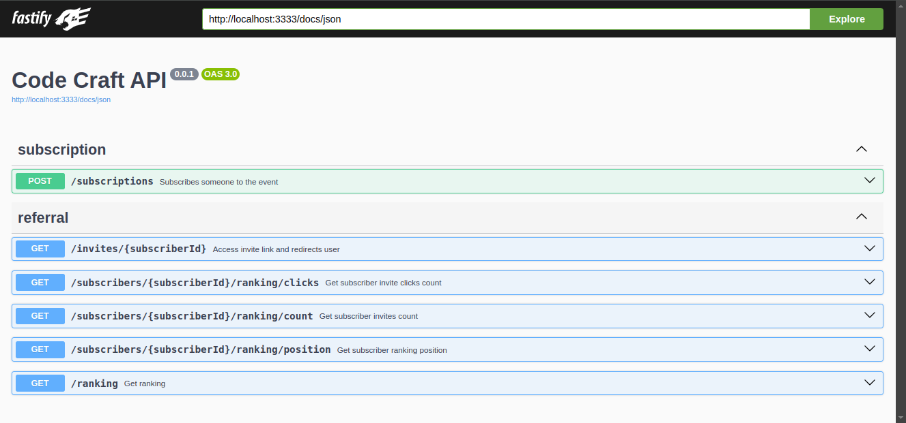

<h1 align="center">Code Craft API</h1>

This backend was built to be used on the <a href="https://github.com/soymattheus/Coding-Event-Enrollment">Code Craft</a> page, which is available on my github.

<h3>Main used technologies</h3>

<ul>
<li>Typescript</li>
<li>Fastify</li>
<li>Drizzle</li>
<li>Redis</li>
<li>Postgres</li>
<li>Zod</li>
</ul>

<h3>Swagger Image</h3>

<h3>To run the project locally follow these steps</h3>
<ol>
<li>Clone the project:</li>

git clone https://github.com/soymattheus/Coding-Event-Enrollment-Api

<li>Enter the cloned project folder</li>

<li>Install required packges:</li>

npm install

<li>Run this command to start databases in Docker</li>

docker compose up -d

<li>Execute this command to create the database DDl</li>

npx drizzle-kit generate

<li>Execute this command to create the database table</li>

npx drizzle-kit migrate

<li>Run the project locally:</li>

npm run dev

</ol>

<h3>To run prod version, follow these steps:</h3>
<ol>
<li>Run the build command:</li>

npm run build

<li>Run the prod project version</li>

npm run prod

</ol>

I hope you like this little project.

If you have any difficulties, you can send me a message via <a href="https://www.linkedin.com/in/mattheusdev/" target="_blank">linkedIn</a>.

If you have ideas, contributions or would like to give any constructive criticism, feel free to message me via <a href="https://www.linkedin.com/in/mattheusdev/" target="_blank">linkedIn</a>. Any contribution will be welcome.
